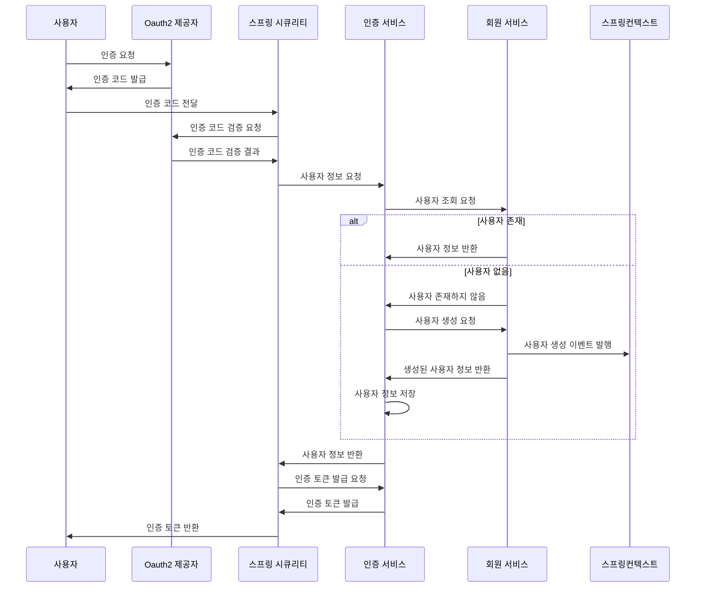

## 인증 서비스
인증 서비스는 사용자의 인증 및 권한 부여를 관리하는 시스템입니다. 
보안 관련 기능은 Spring Security를 사용하며 Oauth2를 사용하여 외부 인증 제공자와 통합할 수 있습니다.
인증 도메인에서는 Spring Security에 위임한 책임을 제외하고, 사용자 관리, 권한 관리, 인증 토큰 발급 등의 기능을 제공합니다.

인증 서비스는 다음과 같은 기능을 제공합니다:
- 사용자 조회/등록 : 외부 인증 제공자(Google, GitHub)로부터 제공 받은 사용자 정보를 기반으로 사용자를 조회 또는 등록(존재하지 않는 경우)합니다. 
- 토근 발급 및 검증: JWT(Json Web Token) 형식의 Access Token, Refresh Token을 사용하여 인증 토큰을 발급하고 검증하는 기능

### 전체 인증 로직(Oauth2 부분은 단순화)
